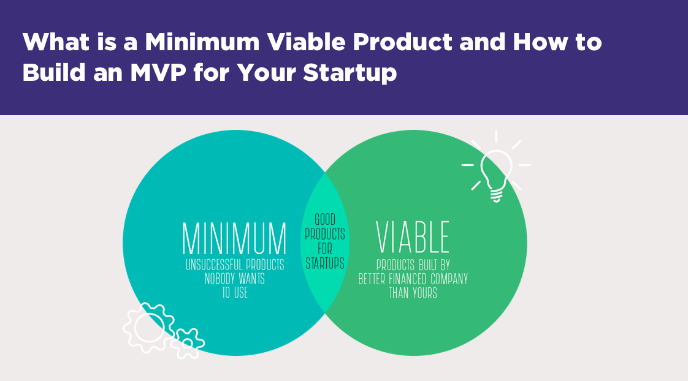

**Please complete within the first week of downloading this repository**

A Minimum Viable Product (MVP) is the smallest subset of features that you consider a project to be a success. Consider your game engine a 'startup' where you are building a product that could challenge a game engine company like [Unity3D](https://unity.com/) or Epic's [Unreal engine](https://www.unrealengine.com). The goal of this exercise is to first define what you will be building and give your instructors early on a chance to tell you if you are doing too much or too little work.

Make a list below of the features you consider to be in your MVP. Then make a list of features that are 'stretch goals' that you think you can achieve. You should be able to achieve all of your MVP features, and a partial subset of your stretch goals.

(MVP) Minimal Subset of features you **will** definitely implement:

1. Game Editor
- A Real-time Platformer Game Editor (User can do the following in real time)
- User can use mouse to add new objects including tiles, enemies, and coins.
- User can change numbers of columns and rows of the tile map.
- User can change the maximum number of lives.
- User can change the starting position of character.
- User can control the character just like playing the game.
- User can load/save current configuration from/to a file.
- User can restart current level.

2. Python API
- User can create and edit the above logics with Python game editor.

Stretch Goals:

1. Stretch Game Editor
- User can move the character to random position.
- User can change background image.
- User can change the whole set of tile images.
- User can change the spritesheet of character.
- User can change the spritesheet of enemy.
- User can edit multiple levels.

2. Stretch Python API
- An API that can create and edit the above stretch logics.
- User can write some Python code to customize game logic.

Note: It is possible you do not hit all of your stretch goals. You should not edit this document to attempt to make your plan look perfect either.

**Instructor Note**: This looks like an acceptable project if you can hit the stretch goal for incorporating the python API to create custom logic. I think that makes this a strong 'platformer game creation system'. Even if the python API is simple (e.g. a  command based language for controlling or setting attributes for game object logic) this would be a neat project.
**Update**: We add Python API part to our mvp.
